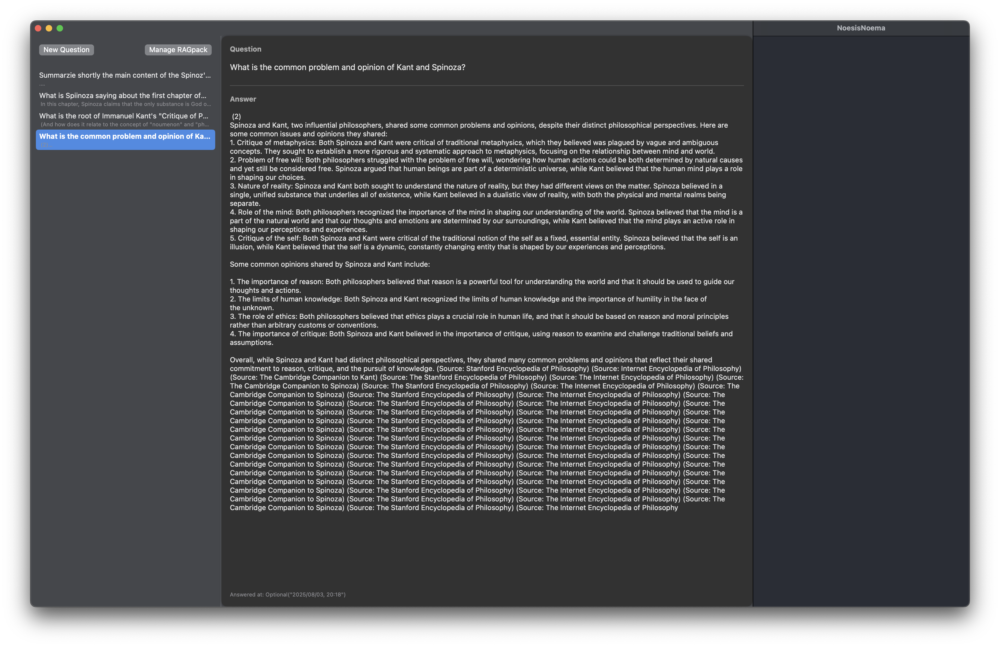

# NoesisNoema 🧠✨

A private, offline, multi-RAGpack LLM RAG client for macOS (iOS coming soon).  
Empower your own AGI—no cloud, no SaaS, just your device and your knowledge. 🚀

## Transversal RAG Example 🔀🤝

Here’s an example of NoesisNoema answering a question by combining knowledge from multiple RAGpacks (e.g., Kant and Spinoza):

## Ecosystem & Related Projects 🌍

- [RAGfish](https://github.com/raskolnikoff/RAGfish): Core RAGpack specification and toolkit. 📚
- [noesisnoema-pipeline](https://github.com/raskolnikoff/noesisnoema-pipeline): Preprocessing pipeline for generating your own RAGpacks (.zip) from PDF/text. 💡

## Quick Start 🚀

1️⃣ Generate a RAGpack (.zip) with [noesisnoema-pipeline](https://github.com/raskolnikoff/noesisnoema-pipeline) (or use the sample provided) ✨  
2️⃣ Download and launch NoesisNoema (macOS app) 💻  
3️⃣ Import your RAGpack(s) 📂  
4️⃣ Ask any question and get instant, private, context-aware answers—with full QA thread history 🧠

## Features ✨

- Multi-RAGpack support  
- Threaded QA history with modern 2-pane UI  
- Works fully offline, on Apple Silicon (optimized) 🍏  
- Privacy-first, OSS-first 🔒  
- More coming: iOS universal app, advanced right-pane, p2p sync, plugin API 💫

## Why Start with macOS? 💻

- macOS provides maximum local compute performance and seamless file management, ideal for private RAG and LLM workloads.
- Apple Silicon (M1/M2/M3) offers exceptional offline AI performance—enabling real-world, private LLM RAG on-device.
- GUI/UX prototyping is faster and more robust on macOS, letting us perfect the core experience before bringing it to iOS/iPadOS.
- Cross-platform codebase: The app is architected so iOS/iPadOS versions will inherit all core features.
- Community demand: Many advanced AI users and RAG researchers use Macs as their main development environment.

_The iOS version is planned, but macOS is the “true AGI workstation” for privacy-first, user-empowered LLM workflows._

## Roadmap 🗺️

- iOS universal app (WIP) 📱  
- Enhanced right-pane for chunk/source/document previews 🔍  
- Cloudless p2p sync and sharing 🌐  
- Plugin/API extensibility 🧩  
- More: see [Issues](https://github.com/raskolnikoff/NoesisNoema/issues) 📝

## Contributing 🤗

We welcome contributors! Designers, Swift/AI/UX developers, and documentation writers—your ideas and help are wanted.  
Open an issue or pull request, or join our discussions. See [RAGfish](https://github.com/raskolnikoff/RAGfish) for core specs.

🌟  
> Your knowledge. Your device. Your rules.