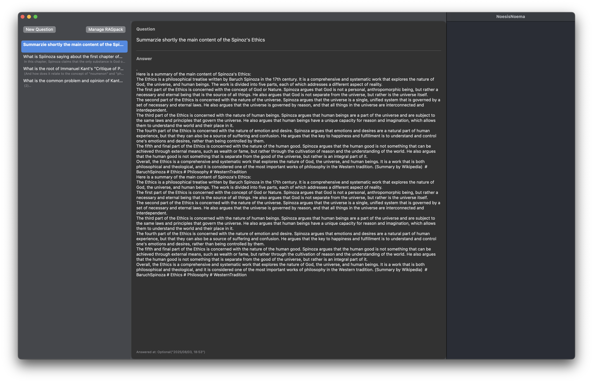
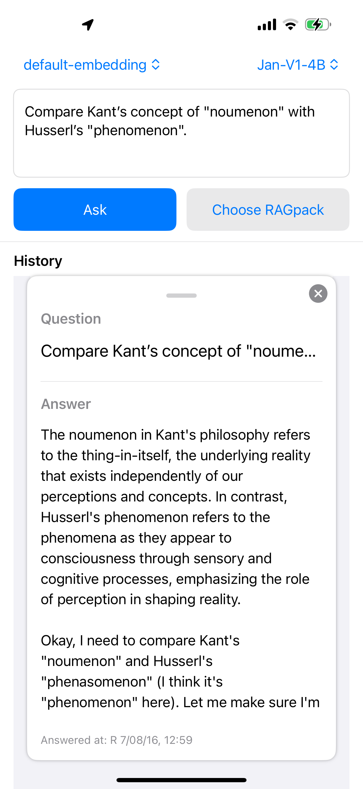

# NoesisNoema 🧠✨

Private, offline, multi‑RAGpack LLM RAG for macOS and iOS.
Empower your own AGI — no cloud, no SaaS, just your device and your knowledge. 🚀

---

## What’s New (Aug 2025) 🔥

The on‑device experience leveled up across macOS and iOS:

- iOS Universal App (iPhone/iPad; shipped)
  - Fresh iOS screenshot available in `docs/assets/noesisnoema_ios.png` (see above)
  - Always‑visible History, QADetail overlays on top (swipe‑down or ✖︎ to close)
  - Multiline input with placeholder, larger tap targets, equal‑width action buttons
  - Global loading lock to prevent duplicate queries; answer only appended once
  - Keyboard UX: tap outside or scroll to dismiss
  - Startup splash overlay: temporary "Noesis Noema" title on launch

- Deep Search retrieval pipeline
  - Two-stage retrieval: LocalRetriever + QueryIterator with MMR re‑ranking
  - Works across multiple RAGpacks; better relevance and source diversity
  - Tuned defaults per device; fast even on iPhone
- Feedback loop (local‑only)
  - Thumbs up/down captured via RewardBus
  - ParamBandit tunes retrieval params per session (topK, mmrLambda, minScore)
  - 100% offline; no telemetry
- Output hygiene & stability
  - Streaming filter removes `<think>…</think>` and control tokens; stop at `<|im_end|>`
  - Final normalization unifies model differences for clean, copy‑ready answers
  - Runtime guard detects broken llama.framework loads; lightweight SystemLog
- RAGpack import is stricter and safer
  - Validates presence of `chunks.json` and `embeddings.csv` and enforces count match
  - De‑duplicates identical chunks across multiple RAGpacks

### Added
- Experimental support for GPT‑OSS‑20B (`gpt-oss-20b-Q4_K_S`, released 2025‑08‑08). Place the model at `Resources/Models/gpt-oss-20b-Q4_K_S.gguf` and select it in the LLM picker (macOS/iOS).
- LLM Presets (Pocket, Balanced, Pro Max) with device‑tuned defaults (threads, GPU layers, batch size, context length, decoding params).
- Liquid Glass design across macOS and iOS with accessibility‑aware fallbacks (respects Reduce Transparency; solid fallback).

macOS keeps its “workstation feel”; iOS now brings the same private RAG, in your pocket. 📱💻

---

## Features ✨

- Multi‑RAGpack search and synthesis
- Transversal retrieval across packs (e.g., Kant × Spinoza)
- Deep Search (query iteration + MMR re‑ranking) with cross‑pack support
- Fast local inference via llama.cpp + GGUF models
- Private by design: fully offline; no analytics; minimal, local SystemLog (no PII)
- Feedback & learning: thumbs up/down feeds ParamBandit to auto‑tune retrieval (session‑scoped, offline)
- Modern UX
  - Two‑pane macOS UI
  - iOS: History always visible; QADetail overlays; copy‑able answers; smooth keyboard handling
  - Multiline question input; equal‑width Ask / Choose RAGpack buttons
- Clean answers, consistently
  - `<think>…</think>` is filtered on the fly; control tokens removed; stop tokens respected
- Thin, future‑proof core
  - llama.cpp through prebuilt xcframeworks (macOS/iOS) with a thin Swift shim
  - Runtime guard + system info log for quick diagnosis

---

## Privacy & Diagnostics 🔒

- 100% offline by default. No network calls for inference or retrieval.
- No analytics SDKs. No telemetry is sent.
- SystemLog is local‑only and minimal (device/OS, model name, params, pack hits, latency, failure reasons). You can opt‑in to share diagnostics.

---

## Requirements ✅

- macOS 13+ (Apple Silicon recommended) or iOS 17+ (A15/Apple Silicon recommended)
- Prebuilt llama xcframeworks (included in this repo):
  - `llama_macos.xcframework`, `llama_ios.xcframework`
- Models in GGUF format
  - Default expected name: `Jan-v1-4B-Q4_K_M.gguf`

> Note (iOS): By default we run CPU fallback for broad device compatibility; real devices are recommended over the simulator for performance.

---

## Quick Start 🚀

### macOS (App)
1. Open the project in Xcode.
2. Select the `NoesisNoema` scheme and press Run.
3. Import your RAGpack(s) and start asking questions.

### iOS (App)
1. Select the `NoesisNoemaMobile` scheme.
2. Run on a real device (recommended).
3. Import RAGpack(s) from Files and Ask.
  - History stays visible; QADetail appears as an overlay (swipe down or ✖︎ to close).
  - Return adds a newline in the input; only the Ask button starts inference.

### CLI harness (LlamaBridgeTest) 🧪
A tiny runner to verify local inference.
- Build the `LlamaBridgeTest` scheme and run with `-p "your prompt"`.
- Uses the same output cleaning to remove `<think>…</think>`.

---

## Using RAGpacks 📦

RAGpack is a `.zip` with at least:

- `chunks.json` — ordered list of text chunks
- `embeddings.csv` — embedding vectors aligned by row
- `metadata.json` — optional, bag of properties

Importer safeguards:
- Validates presence of `chunks.json` and `embeddings.csv` and enforces 1:1 count
- De‑duplicates identical chunk+embedding pairs across packs
- Merges new, unique chunks into the in‑memory vector store

> Tip: Generate RAGpacks with the companion pipeline:
> [noesisnoema-pipeline](https://github.com/raskolnikoff/noesisnoema-pipeline)

---

## Model & Inference 🧩

- NoesisNoema links llama.cpp via prebuilt xcframeworks. You shouldn’t manually embed `llama.framework`; link the xcframework and let Xcode process it.
- Model lookup order (CLI/app): CWD → executable dir → app bundle → `Resources/Models/` → `NoesisNoema/Resources/Models/` → `~/Downloads/`
- Output pipeline:
  - Jan/Qwen‑style prompt where applicable
  - Streaming‑time `<think>` filtering and `<|im_end|>` early‑stop
  - Final normalization to erase residual control tokens and self‑labels

### Device‑optimal presets ⚙️

- A17/M‑series: `n_threads = 6–8`, `n_gpu_layers = 999`
- A15–A16: `n_threads = 4–6`, `n_gpu_layers = 40–80`
- Generation length: `max_tokens` 128–256 (short answers), 400–600 (summaries)
- Temperature: 0.2–0.4, Top‑K: 40–80 for stability

> These are sensible defaults; you can tune per device/pack.

---

## UX Details that Matter 💅

- iOS
  - Interface preview: see screenshot [noesisnoema_ios.png](docs/assets/noesisnoema_ios.png)
  - Multiline input with placeholder; Return adds a newline (does not send)
  - Only the Ask button can start inference (no accidental double sends)
  - During generation: global overlay lock; all inputs disabled (no duplicate queries)
  - Tap outside or scroll History to dismiss the keyboard
  - QADetail overlays History; close with swipe‑down or ✖︎; answers are text‑selectable and copyable
  - Scroll indicators visible in answers to clarify vertical scroll
- macOS
  - Two‑pane layout with History and Detail; same output cleaning; quick import

---

## Engineering Policy & Vendor Guardrails 🛡️

- Vendor code (llama.cpp) is not modified. xcframeworks are prebuilt and checked in.
- Thin shim only: adapt upstream C API in `LibLlama.swift` / `LlamaState.swift`. Other files must not call `llama_*` directly.
- Runtime check: verify `llama.framework` load + symbol presence on startup and log `llama_print_system_info()`.
- If upstream bumps break builds, fix the shim layer and add a unit test before merging.

---

## QA Checklist (release‑ready) ✅

- Accuracy: run same question ×3; verify gist stability at low temperature (0.2–0.4)
- Latency: measure p50/p90 for short/long prompts and multi‑pack queries; split warm vs warm+1
- Memory/Thermals: 10‑question loop; consider thread scaling when throttled
- Failure modes: empty/huge/broken packs; missing model path; user‑facing messages
- Output hygiene: ensure `<think>`/control tokens are absent; newlines preserved
- History durability: ~100 items; startup time and scroll smoothness
- Battery: 15‑minute session; confirm best params per device
- Privacy: verify network off; no analytics; README/UI clearly state offline

---

## Troubleshooting 🛠️

- `dyld: Library not loaded: @rpath/llama.framework`
  - Clean build folder and DerivedData
  - Link the xcframework only (no manual embed)
  - Ensure Runpath Search Paths include `@executable_path`, `@loader_path`, `@rpath`
- Multiple commands produce `llama.framework`
  - Remove manual “Embed Frameworks/Copy Files” for the framework; rely on the xcframework
- Model not found
  - Place the model in one of the searched locations or pass an absolute path (CLI)
- iOS keyboard won’t hide
  - Tap outside the input or scroll History to dismiss
- Output includes control tags or `<think>`
  - Ensure you’re on the latest build; the streaming filter + final normalizer should keep answers clean

---

## Known Issues & FAQ ❓

- iOS Simulator is slower and may not reflect real thermals. Prefer running on device.
- Very large RAGpacks can increase memory usage. Prefer chunking and MMR re‑ranking.
- If you still see `<think>` in answers, capture logs and open an issue (model‑specific templates can slip through).
- Where is `scripts/build_xcframework.sh`?
  - Not included yet. Prebuilt `llama_*.xcframework` are provided in this repo. If you need to rebuild, use upstream llama.cpp build instructions and replace the frameworks under `Frameworks/`.

---

## Roadmap 🗺️

- iOS universal polishing (iPad layouts, sharing/export)
- Enhanced right pane: chunk/source/document previews
- Power/thermal controls (device‑aware throttling)
- Cloudless peer‑to‑peer sync
- Plugin/API extensibility
- CI for App targets

---

## Ecosystem & Related Projects 🌍

- [RAGfish](https://github.com/raskolnikoff/RAGfish): Core RAGpack specification and toolkit 📚
- [noesisnoema-pipeline](https://github.com/raskolnikoff/noesisnoema-pipeline): Generate your own RAGpacks from PDF/text 💡

---

## Contributing 🤗

We welcome Designers, Swift/AI/UX developers, and documentation writers.
Open an issue or PR, or join our discussions. See also [RAGfish](https://github.com/raskolnikoff/RAGfish) for the pack spec.

PR Checklist (policy):
- [ ] llama.cpp vendor frameworks unchanged
- [ ] Changes limited to `LibLlama.swift` / `LlamaState.swift` for core llama integration
- [ ] Smoke/Golden/RAG tests passed locally

---

## From the Maintainers 💬

This project is not just code — it’s our exploration of private AGI, blending philosophy and engineering.  
Each commit is a step toward tools that respect autonomy, curiosity, and the joy of building.  
Stay curious, and contribute if it resonates with you.

🌟
> Your knowledge. Your device. Your rules.

---
## ParamBandit: Thompson Sampling to Select Optimal Parameters per Query 🔬

- What: A lightweight bandit that dynamically selects retrieval parameters (top_k, mmr_lambda, min_score) per query cluster.
- Why: Quickly improves relevance with minimal feedback and provides the feeling of a system that is learning.
- Where: Just before the generator, immediately before the retrieval pipeline.
- How:
  - Maintains Beta(α,β) distributions for each arm (parameter set) and selects using Thompson Sampling.
  - Updates α/β based on feedback events (👍/👎) from the RewardBus.
  - Example default arms: k4/l0.7/s0.20, k5/l0.9/s0.10, k6/l0.7/s0.15, k8/l0.5/s0.15.

Usage example (integration concept)
- Call ParamBandit just before existing LocalRetriever usage points, and perform retrieval with the returned parameters.
- On the UI side, trigger RewardBus.shared.publish(qaId:verdict:tags:) upon user feedback (👍/👎).

Simplified flow:
1) let qa = UUID()
2) let choice = ParamBandit.default.chooseParams(for: query, qaId: qa)
3) let ps = choice.arm.params // topK, mmrLambda, minScore
4) let chunks = LocalRetriever(store: .shared).retrieve(query: query, k: ps.topK, lambda: ps.mmrLambda)
5) Filter by minScore for similarity (see BanditRetriever)
6) On user evaluation, call RewardBus.shared.publish(qaId: qa, verdict: .up/.down, tags: …)

Tests and Definition of Done (DoD)
- Unit: Verify initial α=1, β=1, and that 👍 increments α and 👎 increments β (add to TestRunner, skip in CLI build).
- Integration: Confirm preference converges to the best arm with composite rewards (same as above).
- DoD: Add ParamBandit as an independent service, integrate with RewardBus, define default arms, and provide lightweight documentation (this section).
